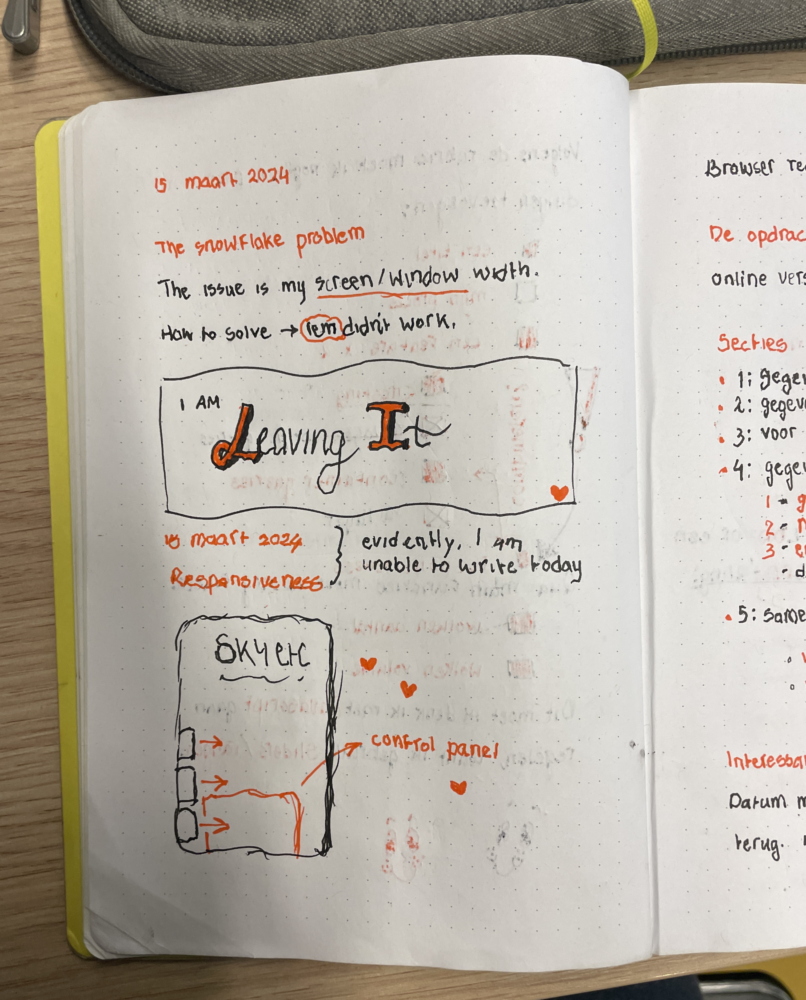
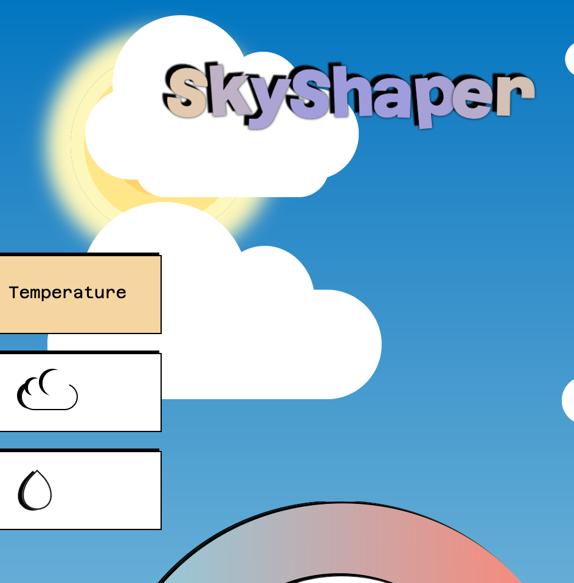
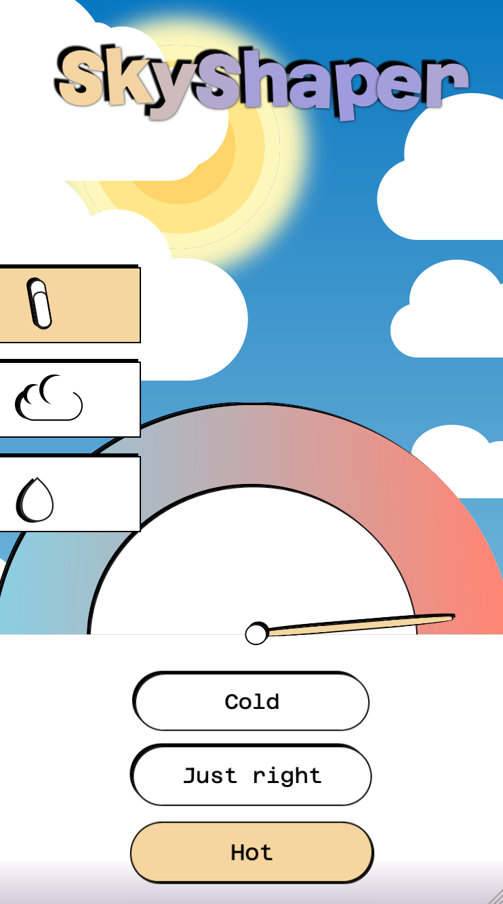

# CSS to the Rescue! 🚀
This is my repository for the course "CSS to the Rescue" during the Web Design &amp; Development minor at AUAS. The assignment was to create a control panel using *only* CSS. It had to be stylistically consistent and it had to work (operate something else).

The course had a few prerequisites for the interaction I had to build:
- Affordance: the user sees _how_ something is operated.
- Feedback: the user recieves feedback _when_ something is operated.
- Status: all controls have a clear status at all times.

## Initial idea

My first idea was to create a calculator controller. I still had to think about the affordance aspect, but since feedback and status are pretty intuitive for this control panel, it seemed like a logical first idea. Due to my initial misunderstanding of the assignment, I presumed that the project stylistically had to resemble a chosen image, which didn't give me much freedom when it came to style. I sketched out a rough idea according to a Flickr photo of an old-school calculator, and began to consider how I could stay true to its style.


When I thought about affordance, however, I wrote down for myself that I *must* control something, but I wondered what that would be. Should the calculator be calculating, or is clicking buttons and having an input returned elsewhere enough? More importantly, how would I manage to do either with CSS?

The 'answer', as noted in my journal, was: "Nevermind this, I'm going for idea 2, the weather machine."

## Process

Because, alternatively, I came up with a *retro lab style* control panel as a weather machine. The pages and sketches dedicated to that idea are as follows:


I doubted whether to use the dial-type indicator for temperature or for the different types of precipitation, but ended up choosing the first. I thought it'd make more sense to see a range of temperatures in a gauge-design than a list, since there's not particularly an order to what kinds of precipitations there are. This led me to the next page in my journal: _change in precipitation_ (the left page of the previous image).

There was one thing I struggled with for a bit: the interaction. This is, of course, terrible, as interaction is what it's (literally) all about. I couldn't wrap my head around the notion of selecting one element and somehow easily selecting another, based on that one element's status, to then manipulate it accordingly. My journal says the following:

"Problem 5/3/2024 13:28: for my temperature gauge, I've defined a _pin needle_ div. On a button click, it should rotate, and later on the scenery should change based on the *rotation* of my pin needle. But such a thing can't be tracked with vanilla CSS!"

I was right, by the way, it really can't be tracked with CSS. But I was setting my eyes on the wrong method. I shouldn't have been aiming to track the rotation of an element - I had to be checking the state of the button that controlled this rotation in the first place. And sidenote, it shouldn't have even been a button - it had to be a radio-button!

It was mostly trial and error. I found that I had to kind of rewire my thinking, constantly asking myself what I was actually intending to do. Once I did that, it worked! Here's how I made the pin needle work:

```css

body > div:first-of-type {
  & > div:nth-of-type(2):has(>input[type=radio]:first-of-type:checked) + div {
    transform: rotate(-85deg);
  }

  & > div:nth-of-type(2):has(>input[type=radio]:nth-of-type(2):checked) + div {
      transform: rotate(0deg);
    }

  & > div:nth-of-type(2):has(>input[type=radio]:nth-of-type(3):checked) + div {
      transform: rotate(85deg);
  }
}

```

To make most, if not all of the controls work, I was very dependent on the structure of my HTML, especially because I wasn't allowed to use classes and ID's. Since I wanted to use the '+' selector in CSS, it was important for whatever to come after the '+' to also come before whatever was before it in HTML. This meant that I had to move my HTML around a bit. I wrote out the logic in my journal so that I wouldn't take any unnecessary steps:


As you can see on the right page, this was also the point where I was thinking of what else I had left to do and what methods to use, including extra ideas like the snow turning to rain when the weather is hot. However, there was still one important step to take, and that was to fix the responsiveness - or rather, implement it.



I decided to use buttons to toggle the different types of controls on a smaller screen, as they of course didn't fit in the viewport together if I showed them all simultaneously. At first, I wanted to make icons for the buttons with single div's, and have the word show up when a control was selected. This looked like the left image below. However, I later realized that this wasn't actually necessary, because the names of the controls are already shown by the controls themselves. So I kept the single icons instead.

 

### Problems, fixed

**Structure and absolute positioning (and its repercussions)**
When asking for feedback, I discovered that I used a lot of unnecessary things. One that really jumped out was my excessive use of `position: absolute`. Looking back, I realize how unnecessary this was and how much harder it made literally everything else, but I think at the time my mind must've been elsewhere. Once I sat and reviewed everything, I was able to 'refresh' my gaze and lean more onto the standard flow of CSS's default stylesheet.

One thing that kind of toppled the rest over was putting the pin needle inside of the temperature gauge. This changed my HTML-structure, which warranted changes in CSS as well. And since the latter consists of an insane amount of `:nth-of-type`'s, I had to really sit and analyze what changes had to be made, same for my interactions (which all broke) and my responsive styling (a media query).

At first, it was all okay. Really. _Until_ I got to the conditional showings of parts of the control panel, dependent on the status of the radio button in the last div that's directly in the body. (Typing out that sentence was a headache in itself.) What I tried was the following:

```css
body:has(> div:nth-of-type(5) > label:nth-of-type(3):has(input:checked)) > div:first-of-type { ... }
```

CSS was *not* okay with this. I spent thirty minutes checking whether or not the selector truly matched the structure of my HTML, if I maybe put a 5 where I had to put a 6, et cetera. The fix?

```css
body:has(> div:nth-of-type(5) > label:nth-of-type(3) input:checked) > div:first-of-type { ... }
```

What this taught me is that using `:has` two times and nested is a no-go. I'm honestly not entirely sure why, but I'm not touching this selector ever again.

**Clouds and the little bit of allowed JavaScript**
To control the clouds, I used range inputs, but my initial steps to realise this idea had way too much JavaScript involved. I was able to fix the cloud heaviness on my own by using a `name=""` on the slider in HTML, but the cloud amount was a lot more complex. With Sanne's help, that turned out to look like this:

_HTML:_ `<input type="range" min="0" max="12" value="0" step="1" name="wolken" />`
_CSS:_ `(cloud div) { animation: zoomies 1s  calc( ( max( var(--index) - var(--wolken), 0)  ) * 10000000000s )  infinite linear backwards; }`

In which `zoomies` is the following animation:

```css
@keyframes zoomies {
  from {
    translate: -100%;
  }

  to {
     translate:calc(100vw + 100%);
  }
}
```

## Reflection

In the end, I was able to realise all of my initial ideas. If I had more time (or a bit more headspace, even), I probably would've added a nicer styling to the overall site. I honestly think it doesn't look as smooth or professional I would've liked. I like the idea of having a site look complex due to its sleekness, but I think it kind of looks a bit botched and amateurish.

I also would've liked to add some easter eggs, like if the temperature was set on 'Hot' and the precipitation type 'Snow' got selected, it would rain instead with a note that said the snow had melted. Or adding trees and manipulating the wind to blow their leaves off. There was so little time, but I think this idea has a lot of cool possibilities. In the future, maybe I'll do more research into styling.

What I _am_ proud of is the structure of my CSS. It's huge, but when you scroll through it, it makes sense, and that's what I was going for. I added headings and also learned how to apply nesting (previously only available in SASS!) which I think is super cool and also satisfying to look at. I'm also proud of my use of `:has`. I genuinely loved using this selector and testing its possibilities combined with nesting, as well as practicing with other selector types like `+` (which I also loved).

I can definitely tell that CSS feels a bit less scary and a bit more amazing, and I'm excited to keep learning about it!

## Sources
1. & nesting selector - CSS: Cascading Style Sheets | MDN. (2024, 24 januari). MDN Web Docs. https://developer.mozilla.org/en-US/docs/Web/CSS/Nesting_selector
2. 3D Rotation - CSS 3D Transformations | CodeGuage. (z.d.). https://www.codeguage.com/courses/css/3d-transformations-rotation
3. Atuonwu, S. C. (2023, 28 december). Native CSS nesting: What you need to know - LogRocket Blog. LogRocket Blog. https://blog.logrocket.com/native-css-nesting/
4. Auto-placement in grid layout - CSS: Cascading Style Sheets | MDN. (2023, 18 september). MDN Web Docs. https://developer.mozilla.org/en-US/docs/Web/CSS/CSS_grid_layout/Auto-placement_in_grid_layout 
5. Background image doesn’t show when defined in stylesheet. (z.d.). Stack Overflow. https://stackoverflow.com/questions/6064965/background-image-doesnt-show-when-defined-in-stylesheet 
6. CSS 3D transforms. (z.d.). https://www.w3schools.com/css/css3_3dtransforms.asp 
7. CSS: centering things. (z.d.). https://www.w3.org/Style/Examples/007/center.en.html
8. CSS gradient Text — CSS gradient. (z.d.). CSS Gradient. https://cssgradient.io/blog/css-gradient-text/
9. CSS nesting and specificity - CSS: Cascading Style Sheets | MDN. (2024, 7 februari). MDN Web Docs. https://developer.mozilla.org/en-US/docs/Web/CSS/CSS_nesting/Nesting_and_specificity 
10. CSS outline Property. (z.d.). https://www.w3schools.com/cssref/pr_outline.php2
11. CSS transition on body background. (2022, 9 januari). kirupaForum. https://forum.kirupa.com/t/css-transition-on-body-background/650380/4
12. Developer, F. (2024, 6 februari). 12+ CSS Rain Effect | Simple Rain Animation Effect. foolishdeveloper.com. https://foolishdeveloper.com/12-css-rain-effect-simple-rain-animation-effect/
13. grid-area - CSS: Cascading Style Sheets | MDN. (2023, 18 juli). MDN Web Docs. https://developer.mozilla.org/en-US/docs/Web/CSS/grid-area
14. How do I create a teardrop in HTML? (z.d.). Stack Overflow. https://stackoverflow.com/questions/30711203/how-do-i-create-a-teardrop-in-html
15. How to vertically center text in a ? (z.d.). Stack Overflow. https://stackoverflow.com/questions/37754621/how-to-vertically-center-text-in-a-span
16. @layer - CSS: Cascading Style Sheets | MDN. (2023, 29 juni). MDN Web Docs. https://developer.mozilla.org/en-US/docs/Web/CSS/@layer
17. Olawanle, J. (2023, 28 juni). How to add text outline with CSS. Kinsta®. https://kinsta.com/blog/css-text-outline/
18. Rémi. (2018, 16 juni). Using box-shadow to construct a border. Codementor. https://www.codementor.io/@michelre/using-box-shadow-to-construct-a-border-ex0rpxvng
19. Rounded trapezoid with CSS. (z.d.). Stack Overflow. https://stackoverflow.com/questions/12710708/rounded-trapezoid-with-css
20. Walicki, A. (2022, 30 juni). Creating basic and more advanced shapes in CSS. Albert Walicki. https://albertwalicki.com/blog/creating-shapes-in-css#trapezoid-shape
21. Wenting Zhang. (2015, 6 november). CSS Icon Tutorial 2 - Draw Sun Icon with Pure Css [Video]. YouTube. https://www.youtube.com/watch?v=TNCngP8w284
22. What is the difference between CSS fit-content and max-content? (z.d.). Stack Overflow. https://stackoverflow.com/questions/30704073/what-is-the-difference-between-css-fit-content-and-max-content