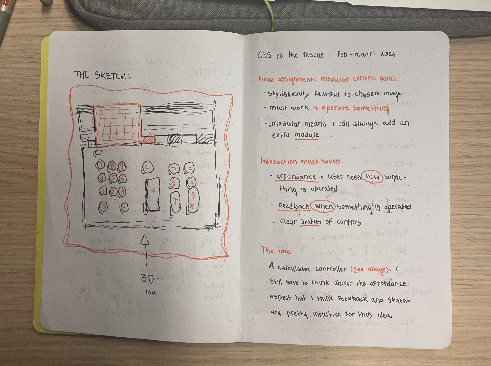
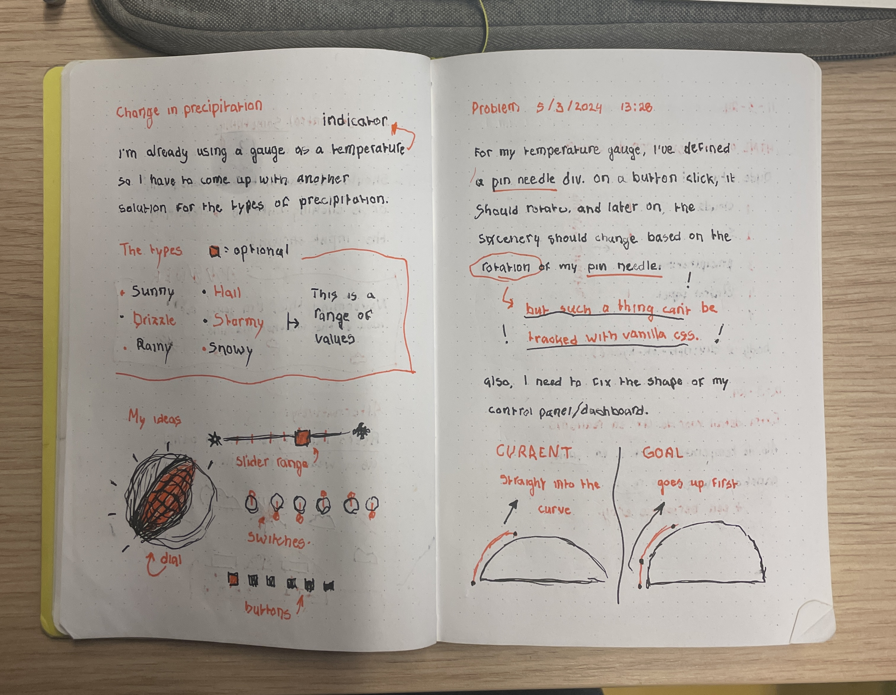
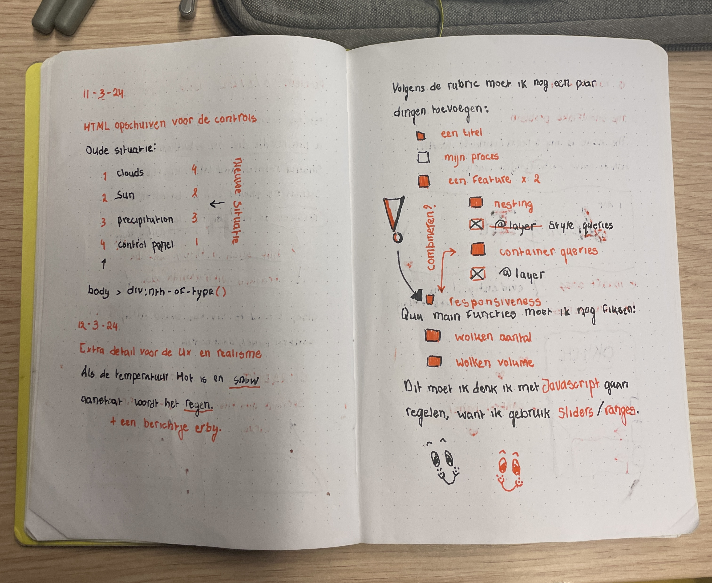

# cssttr
This is my repository for the course "CSS to the Rescue" during the Web Design &amp; Development minor at AUAS. The assignment was to create a control panel using *only* CSS. It had to be stylistically consistent and it had to work (operate something else).

The course had a few prerequisites for the interaction I had to build:
- Affordance: the user sees _how_ something is operated.
- Feedback: the user recieves feedback _when_ something is operated.
- Status: all controls have a clear status at all times.

## Initial idea

My first idea was to create a calculator controller. I still had to think about the affordance aspect, but since feedback and status are pretty intuitive for this control panel, it seemed like a logical first idea. Due to my initial misunderstanding of the assignment, I presumed that the project stylistically had to resemble a chosen image, which didn't give me much freedom when it came to style. I sketched out a rough idea according to a Flickr photo of an old-school calculator, and began to consider how I could stay true to its style.



When I thought about affordance, however, I wrote down for myself that I *must* control something, but I wondered what that would be. Should the calculator be calculating, or is clicking buttons and having an input returned elsewhere enough? More importantly, how would I manage to do either with CSS?

The 'answer', as noted in my journal, was: "Nevermind this, I'm going for idea 2, the weather machine."

## Process

Because, alternatively, I came up with a *retro lab style* control panel as a weather machine. The pages and sketches dedicated to that idea are as follows:



I doubted whether to use the dial-type indicator for temperature or for the different types of precipitation, but ended up choosing the first. I thought it'd make more sense to see a range of temperatures in a gauge-design than a list, since there's not particularly an order to what kinds of precipitations there are. This led me to the next page in my journal: _change in precipitation_ (the left page of the previous image).

There was one thing I struggled with for a bit: the interaction. This is, of course, terrible, as interaction is what it's (literally) all about. I couldn't wrap my head around the notion of selecting one element and somehow easily selecting another, based on that one element's status, to then manipulate it accordingly. My journal says the following:

"Problem 5/3/2024 13:28: for my temperature gauge, I've defined a _pin needle_ div. On a button click, it should rotate, and later on the scenery should change based on the *rotation* of my pin needle. But such a thing can't be tracked with vanilla CSS!"

I was right, by the way, it really can't be tracked with CSS. But I was setting my eyes on the wrong method. I shouldn't have been aiming to track the rotation of an element - I had to be checking the state of the button that controlled this rotation in the first place. And sidenote, it shouldn't have even been a button - it had to be a radio-button!

It was mostly trial and error. I found that I had to kind of rewire my thinking, constantly asking myself what I was actually intending to do. Once I did that, it worked! Here's how I made the pin needle work:

```css

body > div:first-of-type {
  & > div:nth-of-type(2):has(>input[type=radio]:first-of-type:checked) + div {
    transform: rotate(-85deg);
  }

  & > div:nth-of-type(2):has(>input[type=radio]:nth-of-type(2):checked) + div {
      transform: rotate(0deg);
    }

  & > div:nth-of-type(2):has(>input[type=radio]:nth-of-type(3):checked) + div {
      transform: rotate(85deg);
  }
}

```

To make most, if not all of the controls work, I was very dependent on the structure of my HTML, especially because I wasn't allowed to use classes and ID's. Since I wanted to use the '+' selector in CSS, it was important for whatever to come after the '+' to also come before whatever was before it in HTML. This meant that I had to move my HTML around a bit. I wrote out the logic in my journal so that I wouldn't take any unnecessary steps:



As you can see on the right page, this was also the point where I was thinking of what else I had left to do and